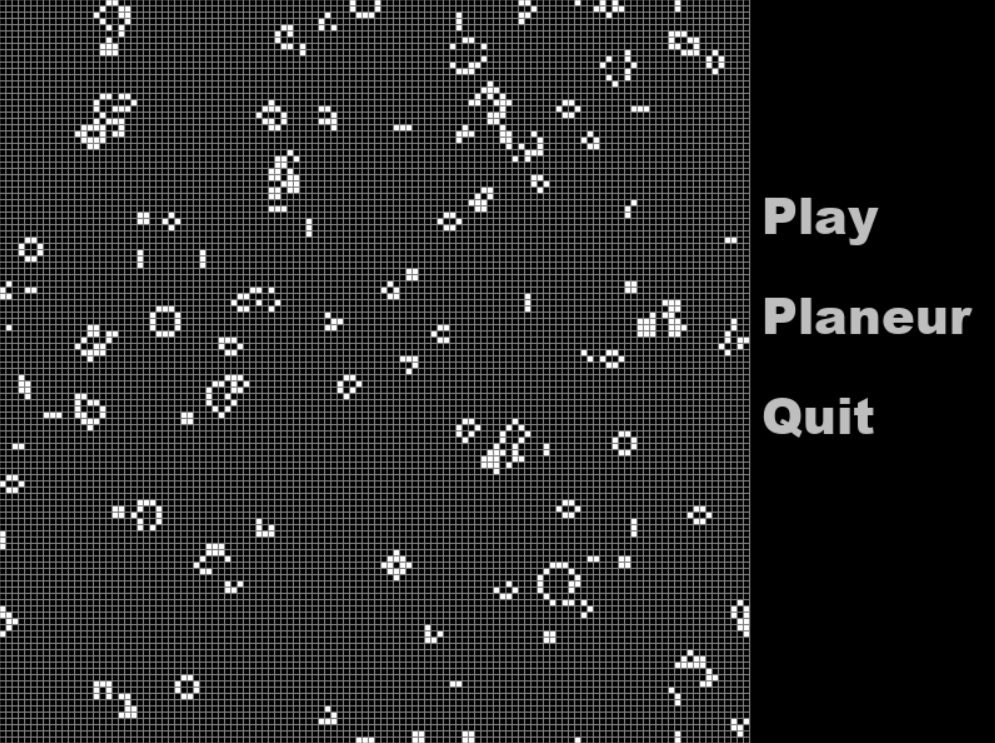

A version of Conway's game of life
I used the tutorial from Tech with Tim for the game and BaralTech for the buttons

It is a periodic version (on a torus), with a menu. It is unfinished but usable.

Use c to clear cells, g to generate them randomly and + and - for the speed.

